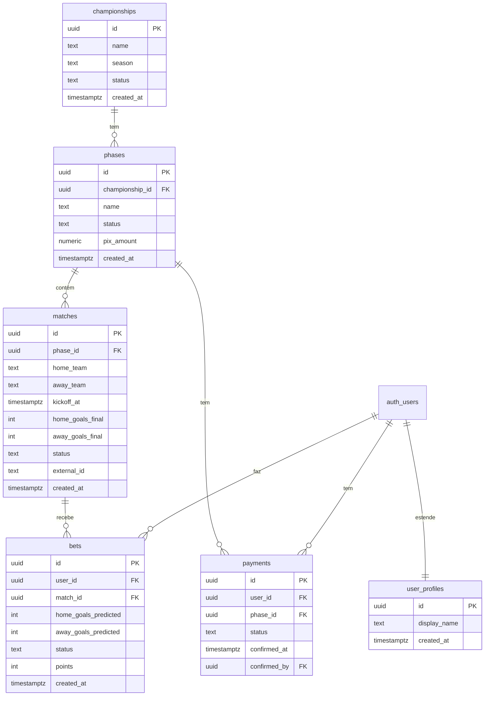
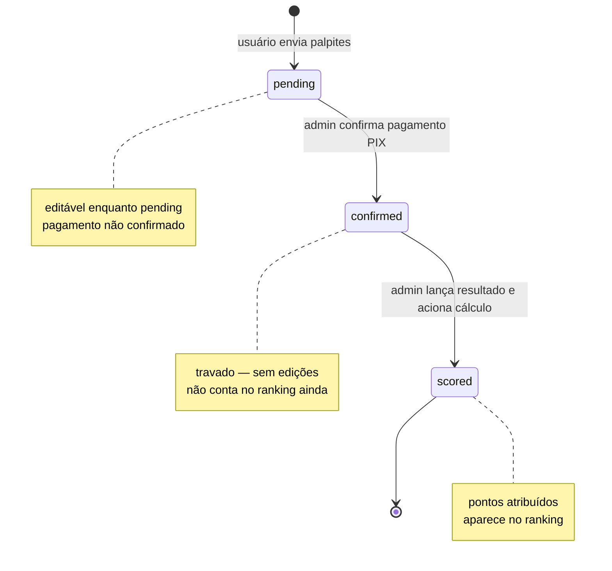
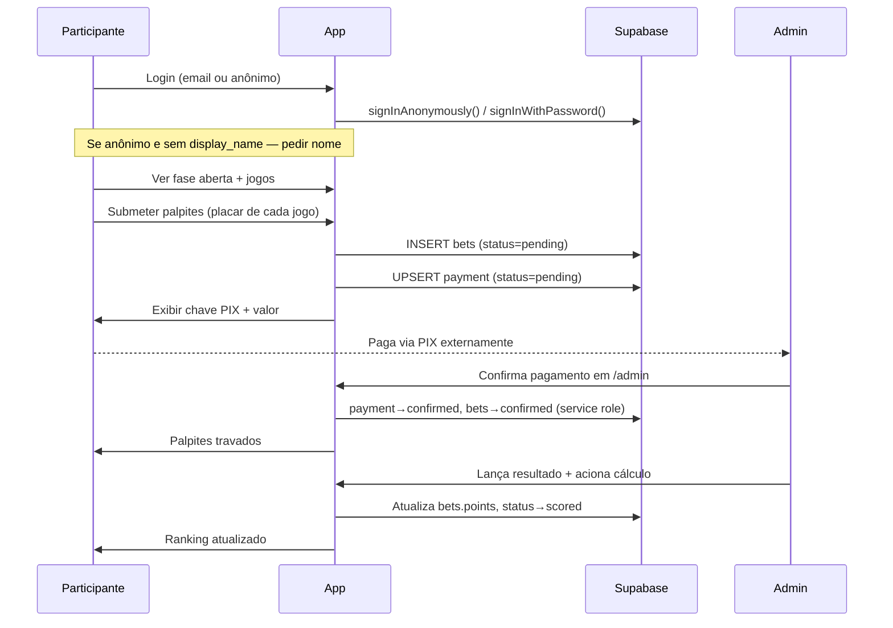
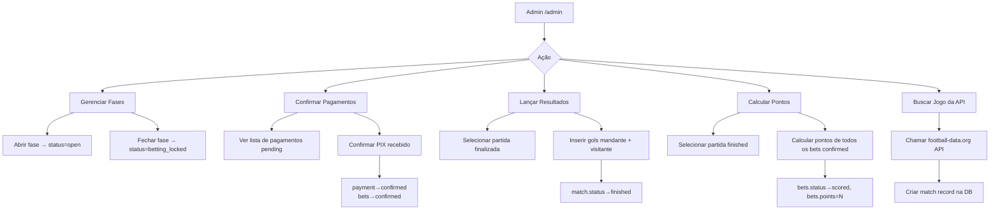

# feat: Build WC Brazil Bolão Application

**Date:** 2026-06-10
**Origin:** `docs/brainstorms/2026-06-10-wc-brazil-bolao-requirements.md`

---

## Summary

Greenfield build of a World Cup pool betting app (bolão) for Brazil's games. Participants predict match scores, pay via PIX, and compete for a prize pot split among the top 3. A single admin controls all phases: opening betting windows, confirming payments, entering results, and triggering score calculations. Built on Next.js 16 App Router, Supabase, TypeScript strict, Tailwind v4, pnpm.

---

## Problem Frame

Friends who want to run a bolão on Brazil's WC 2026 campaign need a dedicated app — not spreadsheets or WhatsApp threads. The app must handle the full cycle: participant registration, bet placement, PIX payment gating, manual admin confirmation, result entry, and a scored ranking with a real prize split.

Scope (see origin):
- Brazil's games only (up to 8 matches across phases)
- Group stage games pre-seeded; knockout games fetched from football-data.org on admin demand
- Anonymous auth is first-class (same capabilities as email users)
- Payment is manual: admin confirms PIX receipt, bets lock permanently
- One championship, one admin, no notifications, no private leagues

---

## Requirements

From origin document:

- **Auth:** Supabase email/password + anonymous sign-in. Anonymous users are full participants; display name captured on first bet.
- **Bet state machine:** placed → `pending` → `confirmed` (admin confirms payment) → `scored` (result entered + calculation triggered). Bets lock at `confirmed` and are never unlocked.
- **Scoring:** exact score = 5 pts, correct winner/draw = 3 pts, one team's goals correct = 1 pt, miss = 0. Highest tier only — not cumulative.
- **Ranking:** confirmed participants only, ordered by total points DESC → exact count DESC → first confirmed bet ASC.
- **Prize:** top-3 split 60 / 30 / 10%.
- **PIX:** static key from `NEXT_PUBLIC_PIX_KEY` env var; amount per phase stored in DB.
- **Admin panel** at `/admin`: phase management, payment confirmation, results entry, score calculation, knockout match import.
- **UI:** Blaze-style dark gaming aesthetic, Tailwind v4 only, all copy in pt-BR.

---

## High-Level Technical Design

### Data Model



### Bet State Machine



### Participant Flow



### Admin Operations



---

## Output Structure

```
app/
  (public)/
    page.tsx                     # Home: fase aberta + cards de jogos
    ranking/
      page.tsx                   # Ranking público
    apostas/
      page.tsx                   # Lista de jogos para apostar
    pagamento/
      page.tsx                   # Tela PIX pós-envio de palpites
  (auth)/
    login/
      page.tsx                   # Login (email ou anônimo)
  admin/
    layout.tsx                   # Layout admin (guard de auth)
    page.tsx                     # Dashboard do admin
    fases/
      page.tsx                   # Gerenciar fases
    pagamentos/
      page.tsx                   # Confirmar pagamentos
    resultados/
      page.tsx                   # Lançar resultados
    pontuacao/
      page.tsx                   # Acionar cálculo de pontos
  layout.tsx                     # Root layout
  globals.css                    # Tailwind v4 + tema Blaze

components/
  match-card.tsx                 # Card de jogo (Blaze-style)
  bet-input.tsx                  # Input de placar por jogo
  pix-display.tsx                # Exibição da chave PIX
  ranking-table.tsx              # Tabela de ranking
  display-name-modal.tsx         # Modal de nome para usuário anônimo
  admin/
    payment-row.tsx              # Linha de pagamento pendente
    result-form.tsx              # Formulário de resultado
    score-trigger.tsx            # Botão acionar cálculo

lib/
  supabase/
    client.ts                    # createBrowserClient wrapper
    server.ts                    # createServerClient wrapper
    admin.ts                     # Service role client (server-only)
  scoring.ts                     # Cálculo puro de pontos (testável)
  football-api.ts                # Cliente football-data.org

actions/
  bets.ts                        # Server Actions: enviar palpites
  payments.ts                    # Server Actions: criar/confirmar pagamento
  matches.ts                     # Server Actions: lançar resultado, buscar API
  scoring.ts                     # Server Actions: calcular pontos

supabase/
  migrations/
    001_initial_schema.sql       # Tabelas + RLS
    002_seed_group_stage.sql     # 3 jogos do Brasil na fase de grupos
  types.gen.ts                   # Tipos gerados (supabase gen types)

proxy.ts                         # Proteção de rotas (Next.js 16)
```

---

## Key Technical Decisions

| Decision | Choice | Rationale |
|---|---|---|
| Supabase client package | `@supabase/ssr` | `auth-helpers` deprecated; `@supabase/ssr` is the current standard for App Router |
| Mutations | Server Actions | Idiomatic App Router; no separate API route boilerplate; progressive enhancement |
| Admin identification | `ADMIN_EMAIL` env var | Single-admin app; simpler than Supabase custom roles; checked in `proxy.ts` + re-verified in every admin Server Action |
| RLS approach | Default-deny; service role in admin Server Actions | Defense-in-depth; `import 'server-only'` marks admin utilities; never expose service key |
| Anonymous user role | `authenticated` with `is_anonymous: true` in JWT | Supabase anonymous auth gives the `authenticated` role, not `anon` — policies differentiate via `auth.jwt()->>'is_anonymous'` |
| Football API | football-data.org free tier | Covers WC 2026; free at 10 req/min; adequate for fetching at most 7–8 match records; Brazil team ID = 764, competition = `WC` |
| Phase amount storage | `phases.pix_amount` column | Per-phase flexibility without env changes; admin sets it when creating a phase |
| Score calculation | TypeScript in Server Action | Pure function in `lib/scoring.ts`; easy to unit test; admin-triggered, so no need for DB triggers |
| Next.js route guard | `proxy.ts` + `proxy` export | Next.js 16 renamed `middleware.ts` → `proxy.ts` and the exported function `middleware` → `proxy` |
| Tailwind config | CSS-only via `@theme {}` in globals.css | v4 has no `tailwind.config.ts`; Blaze theme (dark bg, accent colors) defined as CSS custom properties |
| TypeScript types | `supabase gen types` | Generates strict types from live schema; import into `supabase/types.gen.ts` |

---

## Implementation Units

### Phase 1 — Foundation

---

### U1. Project Setup & Dependencies

**Goal:** Install all required packages, configure environment variables, and establish the Blaze-style Tailwind theme.

**Requirements:** Technical constraints from origin (Supabase, TypeScript strict, Tailwind v4, pnpm).

**Dependencies:** None.

**Files:**
- `package.json` (modify)
- `app/globals.css` (modify — Blaze theme)
- `.env.local.example` (create)
- `lib/supabase/client.ts` (create)
- `lib/supabase/server.ts` (create)
- `lib/supabase/admin.ts` (create)

**Approach:**
- Install: `@supabase/supabase-js`, `@supabase/ssr`, `server-only`
- `lib/supabase/client.ts`: exports a `createClient()` that wraps `createBrowserClient` — for Client Components
- `lib/supabase/server.ts`: exports an async `createClient()` that wraps `createServerClient` with Next.js cookies — for Server Components and Server Actions
- `lib/supabase/admin.ts`: starts with `import 'server-only'`; exports an admin client using the service role key (`SUPABASE_SECRET_KEY`), bypasses RLS — only for admin mutations
- Blaze theme in `globals.css`: dark background (`--color-bg: #0f0f0f`), vibrant green accent (`--color-accent: oklch(0.65 0.2 145)`), bold typography. Define as `@theme {}` CSS custom properties using Tailwind v4 syntax
- `.env.local.example`: document all required vars (`NEXT_PUBLIC_SUPABASE_URL`, `NEXT_PUBLIC_SUPABASE_PUBLISHABLE_KEY`, `SUPABASE_SECRET_KEY`, `NEXT_PUBLIC_PIX_KEY`, `ADMIN_EMAIL`, `FOOTBALL_DATA_API_KEY`)

**Patterns to follow:** Tailwind v4 `@theme {}` block already in `app/globals.css`.

**Test expectation:** none — configuration and client wrappers; coverage via consuming units.

**Verification:** `pnpm install` succeeds; TypeScript compilation passes; Supabase client wrappers export the correct types.

---

### U2. Database Schema, Migrations & Types

**Goal:** Create all tables with correct constraints, RLS policies, and generate TypeScript types.

**Requirements:** Key entities from origin (championship, phase, match, user_profile, bet, payment).

**Dependencies:** U1.

**Files:**
- `supabase/migrations/001_initial_schema.sql` (create)
- `supabase/types.gen.ts` (generated — run `supabase gen types typescript`)

**Approach:**

Tables (all with `uuid` PKs using `gen_random_uuid()` default, `created_at timestamptz default now()`):

- `championships`: `name text not null`, `season text not null`, `status text check(status in ('not_started','active','ended'))`
- `phases`: `championship_id uuid references championships`, `name text not null`, `status text check(status in ('closed','open','betting_locked','finished'))`, `pix_amount numeric not null`
- `matches`: `phase_id uuid references phases`, `home_team text not null`, `away_team text not null`, `kickoff_at timestamptz not null`, `home_goals_final int`, `away_goals_final int`, `status text check(status in ('scheduled','finished','cancelled','postponed'))`, `external_id text`
- `user_profiles`: `id uuid references auth.users on delete cascade`, `display_name text not null`
- `bets`: `user_id uuid references auth.users`, `match_id uuid references matches`, `home_goals_predicted int not null check(home_goals_predicted >= 0)`, `away_goals_predicted int not null check(away_goals_predicted >= 0)`, `status text check(status in ('pending','confirmed','scored'))`, `points int`, `unique(user_id, match_id)`
- `payments`: `user_id uuid references auth.users`, `phase_id uuid references phases`, `status text check(status in ('pending','confirmed'))`, `confirmed_at timestamptz`, `confirmed_by uuid references auth.users`, `unique(user_id, phase_id)`

RLS policies:

```
championships, phases, matches: SELECT for all (including anon role)
user_profiles:
  SELECT for authenticated
  INSERT/UPDATE own profile for authenticated (auth.uid() = id)
bets:
  SELECT own bets for authenticated (auth.uid() = user_id)
  SELECT all scored bets for authenticated (for ranking display)
  INSERT own bets for authenticated, when phase.status = 'open' via check
  UPDATE own pending bets for authenticated (status = 'pending')
  No DELETE
payments:
  SELECT own payment for authenticated
  INSERT own payment for authenticated
  No UPDATE/DELETE (updates done via service role in Server Actions)
```

Admin mutations (confirm payment, score calculation, result entry) all use the service role client — no RLS needed for those paths.

**Patterns to follow:** Supabase documentation for RLS with `auth.uid()` and `auth.jwt()`.

**Test scenarios:**
- Unauthenticated request: can SELECT from `matches`, cannot INSERT into `bets`
- Authenticated user: can INSERT own bet, cannot INSERT bet for another user
- Authenticated user: cannot UPDATE own bet once status = 'confirmed'
- Authenticated user: cannot read another user's `payments` row
- Service role: can UPDATE any bet status (bypasses RLS)

**Verification:** `supabase db push` succeeds; `supabase gen types` produces `supabase/types.gen.ts` without errors; manual RLS policy tests pass in Supabase dashboard.

---

### U3. Route Proxy & Auth Middleware

**Goal:** Protect `/admin` routes, refresh Supabase sessions on every request, redirect unauthenticated users.

**Requirements:** Admin panel auth, single admin user identified by `ADMIN_EMAIL`.

**Dependencies:** U1, U2.

**Files:**
- `proxy.ts` (create — Next.js 16 route guard)
- `app/(auth)/login/page.tsx` (create — placeholder, full UI in U4)

**Approach:**

`proxy.ts` exported function is named `proxy` (Next.js 16 convention):

1. Create a Supabase server client that can read and write request/response cookies (the `@supabase/ssr` pattern for middleware)
2. Call `supabase.auth.getUser()` — never `getSession()` (cannot be spoofed)
3. If path starts with `/admin`: redirect unauthenticated users to `/login`; for authenticated users, check `user.email === process.env.ADMIN_EMAIL`; redirect non-admins to `/`
4. For all paths: refresh session cookies by returning the updated response
5. Matcher config excludes `_next/static`, `_next/image`, `favicon.ico`

Admin email check is a simple string comparison. If `ADMIN_EMAIL` is not set, all `/admin` requests are blocked.

**Test scenarios:**
- Unauthenticated user hits `/admin` → redirected to `/login`
- Authenticated non-admin hits `/admin` → redirected to `/`
- Authenticated admin hits `/admin` → allowed through
- Unauthenticated user hits `/` → allowed through (public page)
- Session cookies are refreshed on every request (no stale session in Server Components)

**Verification:** Login as non-admin user, attempt to access `/admin/pagamentos` — lands on `/`. Login as admin, access `/admin` — allowed.

---

### Phase 2 — Identity & Seed Data

---

### U4. Auth UI & Anonymous Display Name Capture

**Goal:** Sign-in page supporting email/password and anonymous entry; modal to capture display name for anonymous users before their first bet.

**Requirements:** Auth section from origin; anonymous display name outstanding question resolved as "prompt on first bet."

**Dependencies:** U1, U2, U3.

**Files:**
- `app/(auth)/login/page.tsx` (modify — full UI)
- `components/display-name-modal.tsx` (create)
- `actions/auth.ts` (create)

**Approach:**

Login page offers two options:
- "Entrar com e-mail" — standard Supabase email/password form; on success, create a `user_profiles` row with display name derived from email prefix
- "Entrar anonimamente" — calls `signInAnonymously()`, then immediately prompts for display name via modal before redirecting to home

`display-name-modal.tsx`: a full-screen overlay (Blaze-style) that asks "Como você quer aparecer no ranking?" with a single text input and a submit button. Validates min 2 chars. On submit, calls a Server Action that upserts the `user_profiles` row.

The modal also shows at the start of the bet flow (in `app/(public)/apostas/page.tsx`) if the user is authenticated but has no `display_name` yet — prevents bets from being associated with nameless participants.

Server Action in `actions/auth.ts`:
- `saveDisplayName(name: string)`: upserts `user_profiles` for the current user; validates min 2 / max 40 chars server-side

For email users: `user_profiles` row is created during sign-up with the email-prefix as a default display name.

Show a persistent banner for anonymous users: "Você está usando uma conta anônima. Vincule um e-mail para não perder seus palpites." with a link to a future upgrade flow (deferred).

**Test scenarios:**
- Anonymous sign-in: `user_profiles` row created after display name submitted
- Display name too short (< 2 chars): Server Action returns validation error
- Authenticated user with no `user_profiles` row attempts to view `/apostas`: modal appears
- Authenticated user with existing `user_profiles`: modal does not appear
- Email sign-in: `user_profiles` row created with email prefix as default display name

**Verification:** Sign in anonymously, enter display name "João", navigate to ranking — "João" appears as the identifier.

---

### U5. Group Stage Seed Data

**Goal:** Pre-populate Brazil's 3 WC 2026 group stage matches and the championship/phase records.

**Requirements:** "Group stage matches pre-seeded in the database" from origin scope.

**Dependencies:** U2.

**Files:**
- `supabase/migrations/002_seed_group_stage.sql` (create)

**Approach:**

Migration inserts:
1. One `championships` row: `{ name: 'Copa do Mundo 2026', season: '2026', status: 'active' }`
2. One `phases` row for "Fase de Grupos": `{ status: 'closed', pix_amount: 20.00 }` — starts closed, admin opens it
3. Three `matches` rows for Brazil's group stage games with known opponents, dates, and `status: 'scheduled'`

Use `ON CONFLICT DO NOTHING` so re-running migrations is safe.

Group stage opponents for Brazil at WC 2026 (to be filled in with actual draw results — placeholder values until draw is confirmed; admin can update via the admin panel if needed).

**Test expectation:** none — seed data; verified by querying the DB after migration.

**Verification:** `supabase db push` runs; query `select * from matches join phases on phases.id = matches.phase_id` returns 3 rows for the group stage phase.

---

### Phase 3 — Participant Flow

---

### U6. Public Phase & Match Display

**Goal:** Home page showing the current open betting phase and its match cards; handles states: no open phase, bets already submitted, waiting for payment confirmation.

**Requirements:** Participant flow steps 1–2 from origin.

**Dependencies:** U2, U3, U4.

**Files:**
- `app/(public)/page.tsx` (modify — replace scaffold)
- `components/match-card.tsx` (create)

**Approach:**

`app/(public)/page.tsx` is a Server Component:
- Fetches the current phase with `status = 'open'` (at most one at a time)
- Fetches all matches for that phase
- Fetches the current user's payment status for this phase (if signed in)
- Renders three states:
  1. No open phase → "Nenhuma rodada aberta no momento"
  2. Open phase, user has no confirmed payment → show match cards + "Fazer Palpites" CTA
  3. Open phase, user has `pending` payment → show PIX reminder card
  4. Open phase, user has `confirmed` payment → show locked bets summary

`components/match-card.tsx`: shows home team vs away team, date/time of kickoff, match status. Blaze-style card with team names in bold, date in muted color, dark background.

Each data-fetch is an isolated function in a separate file (e.g., `lib/data/phases.ts`, `lib/data/matches.ts`) returning typed results.

**Test scenarios:**
- No open phase in DB → home page renders "Nenhuma rodada aberta"
- Open phase with 3 matches → 3 match cards render
- Authenticated user with pending payment → PIX reminder shown instead of CTA
- Authenticated user with confirmed payment → locked bets summary
- Unauthenticated user → match cards visible, CTA links to `/login`

**Verification:** Open a phase in admin, navigate to `/` — 3 match cards appear. Submit bets, return to `/` — PIX reminder card appears.

---

### U7. Bet Placement Flow

**Goal:** Allow authenticated users to submit score predictions for all open-phase matches; create a payment record after submission.

**Requirements:** Participant flow steps 2–4 from origin; bet state machine.

**Dependencies:** U2, U3, U4, U6.

**Files:**
- `app/(public)/apostas/page.tsx` (create)
- `components/bet-input.tsx` (create)
- `actions/bets.ts` (create)
- `actions/payments.ts` (create)

**Approach:**

`app/(public)/apostas/page.tsx`:
- Fetches open phase + matches + user's existing pending bets (if any)
- If user has no `display_name`, renders `<DisplayNameModal>` first
- Renders a form with one `<BetInput>` per match (home goals / away goals, each an integer ≥ 0)
- Single "Enviar Palpites" submit button at the bottom

`components/bet-input.tsx`: two number inputs (min=0, step=1) labeled with team names. Handles both new bets and editing existing pending bets.

`actions/bets.ts`:
- `submitBets(formData: FormData)`: validates all inputs are non-negative integers; upserts bets for the current user (one per match); sets all to `status: 'pending'`; only allowed when phase is `open` and user has no `confirmed` payment for this phase

`actions/payments.ts`:
- `createPayment(phaseId: string)`: upserts a `payments` row `{user_id, phase_id, status: 'pending'}`; called after successful bet submission; idempotent

After `submitBets` + `createPayment` succeed: redirect to `/pagamento`.

**Test scenarios:**
- Happy path: submit all 3 match scores → 3 bets created, payment record created, redirected to `/pagamento`
- Partial submission (only some matches filled): Server Action returns validation error — all matches required
- Negative value in input: validation error
- Non-integer value: validation error (HTML `type=number step=1` + server-side check)
- User re-submits: bets are upserted (not duplicated); `UNIQUE(user_id, match_id)` constraint enforced
- User with confirmed payment attempts to submit: Server Action rejects (phase already paid)
- Phase not open: Server Action rejects
- Unauthenticated request: Server Action returns auth error

**Verification:** Submit bets as a test user, inspect `bets` table — 3 rows with `status='pending'`. Submit again with different scores — same 3 rows updated.

---

### U8. PIX Payment Screen

**Goal:** Post-bet-submission screen displaying the static PIX key, amount, and a "waiting for confirmation" state.

**Requirements:** Participant flow steps 4–6 from origin; PIX section of origin.

**Dependencies:** U2, U7.

**Files:**
- `app/(public)/pagamento/page.tsx` (create)
- `components/pix-display.tsx` (create)

**Approach:**

`app/(public)/pagamento/page.tsx`:
- Server Component; fetches the user's `pending` payment for the current phase
- If no pending payment: redirects to `/` (user shouldn't be here)
- If confirmed payment: shows "Palpites confirmados!" success state with link to ranking
- If pending: renders `<PixDisplay>` + waiting state

`components/pix-display.tsx`: Shows:
- Chave PIX (from `NEXT_PUBLIC_PIX_KEY` env var)
- Valor (from `phases.pix_amount`)
- Copy-to-clipboard button for the PIX key
- Instruction text: "Faça o pagamento e aguarde a confirmação do admin."
- "Meus palpites" collapsible section showing the submitted predictions (read-only)

Page polls for payment status change every 30 seconds via client-side refetch (simple `setInterval` + router.refresh()) so the confirmation state auto-updates when the admin confirms.

**Test scenarios:**
- User with pending payment: PIX screen renders with key and amount
- User without pending payment: redirected to `/`
- User with confirmed payment visiting `/pagamento`: shows success state
- Copy PIX key button: copies `NEXT_PUBLIC_PIX_KEY` to clipboard
- Auto-refresh: after admin confirms, page transitions to success state within ~30s without manual reload

**Verification:** Submit bets, land on `/pagamento`, see PIX key and amount. Admin confirms payment, wait 30s — page shows "Palpites confirmados!".

---

### Phase 4 — Admin Panel

---

### U9. Admin Layout & Route Guard

**Goal:** Admin shell with navigation and server-side auth verification on every admin page.

**Requirements:** Admin Panel section from origin.

**Dependencies:** U1, U3.

**Files:**
- `app/admin/layout.tsx` (create)
- `app/admin/page.tsx` (create)

**Approach:**

`app/admin/layout.tsx`:
- Server Component; calls `supabase.auth.getUser()` via the server client
- Re-verifies admin email (`user.email === process.env.ADMIN_EMAIL`) — never relies solely on `proxy.ts`
- If not admin: renders an unauthorized message (does not redirect — proxy already handled redirect)
- Renders a minimal sidebar nav: Campeonato, Fases, Pagamentos, Resultados, Pontuação, Ranking
- Blaze-style but functional: dark sidebar, clear active state

`app/admin/page.tsx`: Dashboard showing counts — open phases, pending payments, scheduled matches, scored bets.

**Test scenarios:**
- Server Component rendered with non-admin user session: shows unauthorized message
- Server Component rendered with admin user session: renders nav and children
- `ADMIN_EMAIL` env var not set: all admin layout renders unauthorized

**Verification:** Log in as non-admin, manually navigate to `/admin` — "Acesso negado" shown. Log in as admin — dashboard renders.

---

### U10. Phase Management

**Goal:** Admin can create phases, open/close them, and manage their matches.

**Requirements:** Admin capabilities: create/manage phases, add matches.

**Dependencies:** U2, U9.

**Files:**
- `app/admin/fases/page.tsx` (create)
- `actions/phases.ts` (create)

**Approach:**

`app/admin/fases/page.tsx`:
- Lists all phases with their status (closed / open / betting_locked / finished)
- Per-phase actions:
  - "Abrir" (closed → open): allows new bets
  - "Fechar para apostas" (open → betting_locked): no new bets; keeps confirmed bets
  - "Finalizar" (betting_locked → finished): all done
- "Nova Fase" form: name, pix_amount, auto-linked to the active championship

`actions/phases.ts`:
- `createPhase(name, pixAmount)`: inserts into `phases`; admin-only (re-verifies via service role)
- `updatePhaseStatus(phaseId, newStatus)`: validates transition rules; admin-only
- Only one phase may have `status = 'open'` at a time (enforced in Server Action)

**Test scenarios:**
- Create phase "Oitavas de Final" with pix_amount 25.00: phase created with status='closed'
- Open phase: status transitions to 'open'; existing open phase fails (only one open at a time)
- Close phase with pending payments: allowed (betting window closes, pending payments remain)
- Non-admin request to Server Action: rejected

**Verification:** Create a phase, set to open, confirm it appears on the participant home page as the active betting phase.

---

### U11. Payment Confirmation Panel

**Goal:** Admin can view pending payments and confirm each one, which locks the participant's bets.

**Requirements:** Admin flow step 2 from origin; bet state machine transition `pending → confirmed`.

**Dependencies:** U2, U9, U7.

**Files:**
- `app/admin/pagamentos/page.tsx` (create)
- `components/admin/payment-row.tsx` (create)
- `actions/payments.ts` (modify — add `confirmPayment`)

**Approach:**

`app/admin/pagamentos/page.tsx`:
- Fetches all `payments` with `status = 'pending'`, joined with `user_profiles` and the phase name
- Shows participant name, phase, date of bet submission
- Each row has a "Confirmar PIX" button

`confirmPayment(paymentId, userId, phaseId)` Server Action:
1. Uses admin Supabase client (service role)
2. `UPDATE payments SET status='confirmed', confirmed_at=now(), confirmed_by=<adminId> WHERE id=<paymentId>`
3. `UPDATE bets SET status='confirmed' WHERE user_id=<userId> AND match_id IN (SELECT id FROM matches WHERE phase_id=<phaseId>)`
4. Both updates run sequentially in the same request (Supabase doesn't support multi-statement transactions via the JS client — use a PostgreSQL function or accept two sequential writes with idempotency)
5. Re-verifies admin before executing

The atomicity concern: if the bets update fails after payment update, the payment shows confirmed but bets remain pending. Mitigate by wrapping both in a Supabase RPC function (PostgreSQL function) that runs atomically.

**Test scenarios:**
- Confirm payment for user A in phase 1: `payments` row → confirmed, all user A's bets in phase 1 → confirmed
- Confirm the same payment twice: second call is a no-op (idempotent)
- User A's bets are now read-only: attempt to submit new bets for phase 1 is rejected
- Non-admin request: rejected
- Partial failure (bets update fails): payment should not be marked confirmed — handle via RPC function

**Verification:** Confirm a payment in `/admin/pagamentos`, check the participant's `/pagamento` page — transitions to "Palpites confirmados!".

---

### U12. Match Results Entry

**Goal:** Admin can enter the final score for a completed match.

**Requirements:** Admin flow step 3 from origin.

**Dependencies:** U2, U9.

**Files:**
- `app/admin/resultados/page.tsx` (create)
- `components/admin/result-form.tsx` (create)
- `actions/matches.ts` (create)

**Approach:**

`app/admin/resultados/page.tsx`:
- Lists matches in the current phase with `status = 'scheduled'` or `'finished'`
- For scheduled matches past their kickoff: shows `<ResultForm>` inline
- For finished matches: shows recorded result (read-only)

`components/admin/result-form.tsx`: Two number inputs (home goals, away goals, both ≥ 0) with a "Salvar Resultado" button.

`enterResult(matchId, homeGoals, awayGoals)` Server Action:
- Validates inputs are non-negative integers
- `UPDATE matches SET home_goals_final=<H>, away_goals_final=<A>, status='finished' WHERE id=<matchId>`
- Does not trigger scoring automatically — scoring is a separate admin action (U13)
- Admin-only

**Test scenarios:**
- Enter valid result 2-1: match updated to status='finished', goals recorded
- Enter result for match that already has a result: Server Action rejects (immutable after first entry)
- Negative value: validation error
- Non-integer: validation error
- Non-admin request: rejected

**Verification:** Enter 2-1 for a match in admin, navigate to `/resultados`, see the result recorded with status 'finished'.

---

### U13. Score Calculation

**Goal:** Admin triggers point calculation for a finished match; updates all confirmed bets with points and moves them to `scored`.

**Requirements:** Scoring rules from origin; admin flow step 4.

**Dependencies:** U2, U9, U12.

**Files:**
- `app/admin/pontuacao/page.tsx` (create)
- `components/admin/score-trigger.tsx` (create)
- `actions/scoring.ts` (create)
- `lib/scoring.ts` (create)
- `lib/scoring.test.ts` (create)

**Approach:**

`lib/scoring.ts` — pure function, no Supabase dependency:

```
calculatePoints(
  predicted: { home: number; away: number },
  actual: { home: number; away: number }
): number
  1. if predicted === actual (both) → 5
  2. else if sign(predicted.home - predicted.away) === sign(actual.home - actual.away) → 3
  3. else if predicted.home === actual.home OR predicted.away === actual.away → 1
  4. else → 0
```

`triggerScoring(matchId)` Server Action in `actions/scoring.ts`:
1. Fetch match — must be `status='finished'` with both goals set
2. Fetch all `bets` with `match_id=<matchId>` and `status='confirmed'`
3. For each bet: calculate points via `calculatePoints()`
4. Batch `UPDATE bets SET points=<N>, status='scored' WHERE id=<betId>` using admin client
5. Admin-only; idempotent if called twice (same result)

`app/admin/pontuacao/page.tsx`: Lists finished matches not yet scored (all bets still `confirmed`); shows a "Calcular Pontos" button per match via `<ScoreTrigger>`.

**Test scenarios for `lib/scoring.ts`:**
- Exact score (2-1 predicted, 2-1 actual) → 5
- Correct result, home win (3-1 predicted, 1-0 actual) → 3
- Correct result, draw (1-1 predicted, 0-0 actual) → 3
- Correct result, away win (0-2 predicted, 1-3 actual) → 3
- Partial, home goals match (2-1 predicted, 2-3 actual) → 1 (away win both, but wait — home wins vs away win = wrong result; home goals 2=2 → partial = 1)
- Partial, away goals match (2-1 predicted, 0-1 actual) → 1 (home win vs away win; away goals 1=1 → partial)
- Complete miss (3-0 predicted, 0-2 actual) → 0
- 0-0 exact (0-0 predicted, 0-0 actual) → 5
- Correct result blocks partial: predicted 2-1 (home win), actual 3-1 (home win) → 3 not 1 (away goals both = 1, but result tier wins)

**Test scenarios for `triggerScoring` Server Action:**
- Match not finished: rejected
- Match has no confirmed bets: no-op, succeeds
- 3 confirmed bets: all 3 updated to scored with correct points
- Calling twice on same match: second call is idempotent (already-scored bets ignored)
- Non-admin: rejected

**Verification:** Enter result 2-1 for a match, trigger scoring, check `bets` table — all confirmed bets now have `status='scored'` and correct `points` values.

---

### U14. Knockout Match Fetch

**Goal:** Admin triggers a fetch from football-data.org to create the next Brazil match record for a knockout phase.

**Requirements:** "Admin-triggered API fetch for knockout stage matches" from origin; football API KTD.

**Dependencies:** U2, U9, U10.

**Files:**
- `app/admin/fases/page.tsx` (modify — add "Buscar Próximo Jogo" button)
- `lib/football-api.ts` (create)
- `actions/matches.ts` (modify — add `fetchNextBrazilMatch`)

**Approach:**

`lib/football-api.ts`:
- `fetchBrazilNextMatch(phaseId: string)`: calls `GET https://api.football-data.org/v4/competitions/WC/matches?season=2026&team=764` with `X-Auth-Token` header from `FOOTBALL_DATA_API_KEY` env var
- Filters for the next `status: 'SCHEDULED'` match
- Returns `{ homeTeam, awayTeam, kickoffAt, externalId }`

`fetchNextBrazilMatch(phaseId)` Server Action in `actions/matches.ts`:
1. Calls `lib/football-api.ts`
2. Checks `external_id` — skip if match already exists in DB (idempotent)
3. Inserts a `matches` row linked to the given phase
4. Admin-only

Error handling: if API returns no scheduled match (Brazil eliminated), show "Nenhum próximo jogo encontrado."

**Technical design (directional):** API response filtering is done in `lib/football-api.ts`. The Server Action handles DB write only. Keep the API client purely functional (no DB access).

**Test scenarios:**
- API returns a scheduled match: match record created with correct teams/date/external_id
- API returns empty: Server Action returns "no match found" user-facing message
- Same match fetched twice (same external_id): second insert is a no-op
- API key missing: Server Action returns configuration error
- Non-admin request: rejected
- Network failure: Server Action returns error message (no DB write)

**Verification:** Trigger "Buscar Próximo Jogo" for a knockout phase, see a new match record in admin; confirm it appears on the participant home page.

---

### Phase 5 — Ranking

---

### U15. Public Ranking Page

**Goal:** Display the live ranking of all confirmed participants with their points, exact scores, and prize amounts.

**Requirements:** Ranking section from origin; prize split 60/30/10.

**Dependencies:** U2, U13.

**Files:**
- `app/(public)/ranking/page.tsx` (create)
- `components/ranking-table.tsx` (create)

**Approach:**

`app/(public)/ranking/page.tsx` — Server Component, renders every 60s (Next.js `revalidate = 60`):

Ranking query (via Supabase server client):
- Join `payments` (status='confirmed') with `user_profiles` and aggregate `bets` (status='scored')
- Columns: `display_name`, `total_points` (SUM of points, COALESCE 0), `exact_scores` (COUNT where points=5), `first_confirmed_bet_at` (MIN created_at of confirmed/scored bets)
- ORDER BY `total_points DESC`, `exact_scores DESC`, `first_confirmed_bet_at ASC`

This is exposed as a typed server-side query function — not a raw SQL string inline in the page.

Prize display: compute and show prize amounts for positions 1–3 based on a total pot (sum of all confirmed `phases.pix_amount × confirmed participants`). Display as "Prêmio estimado: R$ X" — marked as estimated since it depends on final confirmed count.

`components/ranking-table.tsx`: medal icons for top 3 (🥇🥈🥉), participant name, total points, exact scores, prize amount. Remaining rows without medals. Bold accent color for 1st place.

Unauthenticated users can view the ranking (public read access).

**Test scenarios:**
- No confirmed participants: "Nenhum participante confirmado ainda"
- 1 confirmed participant with scored bets: appears with correct points
- Two participants tied on points and exact scores: ordered by first confirmed bet date
- Participant with confirmed payment but no scored bets yet: appears with 0 points
- Prize column: 1st = 60% of total pot, 2nd = 30%, 3rd = 10%
- Unauthenticated user: ranking is visible
- Page revalidates every 60s (stale reads acceptable for ranking)

**Verification:** Complete a full cycle — 2 participants submit bets, admin confirms payments, admin enters result and triggers scoring. Navigate to `/ranking` — both participants appear with correct scores.

---

## Scope Boundaries

**Included in this plan:** All 15 implementation units above covering the full brainstorm scope.

**Deferred to follow-up work:**
- Anonymous → email account upgrade UI (the "vincular e-mail" flow — banner is shown but the actual link flow is deferred)
- Tie-breaking in prize split (two participants in 3rd place — admin decides manually for now)
- Admin edit of pre-seeded group stage match details (dates/teams in case draw results change)
- Real-time ranking updates (currently 60s revalidation; could be Supabase Realtime subscription later)

**Outside this product's scope:**
- Automatic PIX detection
- Email/push notifications
- Private leagues or invite links
- Per-round prize distribution
- Bets on non-Brazil matches

---

## Risks & Dependencies

| Risk | Impact | Mitigation |
|---|---|---|
| `confirmPayment` partial failure (payment confirmed, bets not updated) | High — participant shows as paid but bets not locked | Wrap in a Supabase PostgreSQL RPC function for atomicity |
| football-data.org free tier goes down or changes endpoint | Medium — admin cannot fetch knockout match | Keep endpoint URL in env var; admin can manually create match as fallback |
| Anonymous session lost (user clears storage) | Medium — participant loses their bets | UI warning (implemented); no technical mitigation possible |
| Next.js 16 `proxy.ts` not in user's version | Low — app exists on Next.js 16.2.8 confirmed | Confirmed in package.json |
| `supabase gen types` diverges from actual schema after migration edits | Low — type errors at compile time surface it | Run type gen as part of dev workflow after every migration |

---

## Open Questions

- **Seed data accuracy:** Brazil's group stage opponents at WC 2026 need to be confirmed from the actual draw. Placeholder values in the migration — update before opening the app.
- **PIX amount per phase:** `phases.pix_amount` is set at phase creation time by admin. The README should document this so the admin knows where to set it.
- **Admin email in prod:** `ADMIN_EMAIL` must be set in the production environment before the app goes live, or the admin panel is inaccessible.
